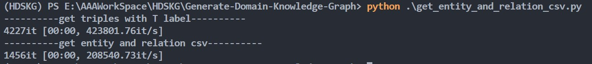

# Generate Domain Specific Knowledge Graph
## Tool
- [neo4j](https://neo4j.com/download-center/#community) used in this paper

## Usage
1. `python .\get_entity_and_relation_csv.py` to get __entity_csv.csv__ and __relation_csv.csv__
   
2. use neo4j's __amdin-import__ tool to import all entities and relations
3. You can run `.\import.bat` to import automatically.
   __Notice__ that you need to change the absolute path of entity_csv and relation_csv in your own environment. 