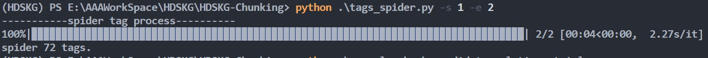
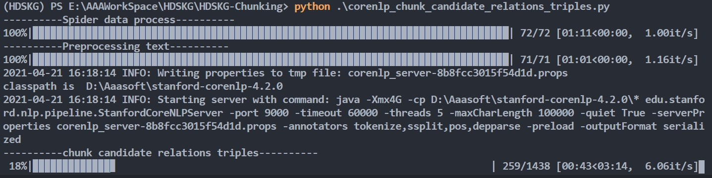

# The implementation of HDSKG Chunking

## Usage
1. `python tags_spider.py --start 1 --end 5`
   to spider tags from page 1 to 5 in stackoverflow ranked by popularity.
   <!-- 

      
    
 -->
    
2. `python .\corenlp_chunk_candidate_relations_triples.py`
   to spider data from tags' page, preprocess text(resolve coreference) and chunk candidate relation triples
   <!-- 

      
    
 -->
    
3. After above 2 steps,
   - In ___txts___ folder you can get `tags.txt` generated by __spider tag process__ 
   - In ___csvs___ folder you can get `input_sentence.csv` generated by __preprocessing text__ and `candidate_relation_triples.csv` generated by __chunk candidate relation triples__