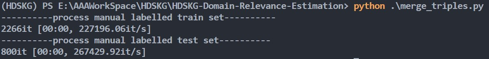

# The implementation of HDSKG Domain Relevance Estimation

## Manual Labeled Triples
1. In this part, you firstly need to label triples manually, and divide them into two parts like __manual_labeled_train_set.csv__ and __manual_labeled_test_set.csv__
2. Secondly, `python .\merge_triples.py` to process these two set: merge `(entity, relation, entity)` to a `sentence` as the input of BERT model, like __processed_train_set.csv__ and __processed_test_set.csv__
   

## Fine Tuned BERT model
- When I plan to use BERT model, I find [this github](https://github.com/Rvlis/demo_text_binary_classification_bert) written by wshuyi.
- Run this notebook `binary_classification_model_BERT.ipynb` to learn how to fine-tune(train) and evaluate a BERT model and use this fine-tuned BERT to predict the left triples.
