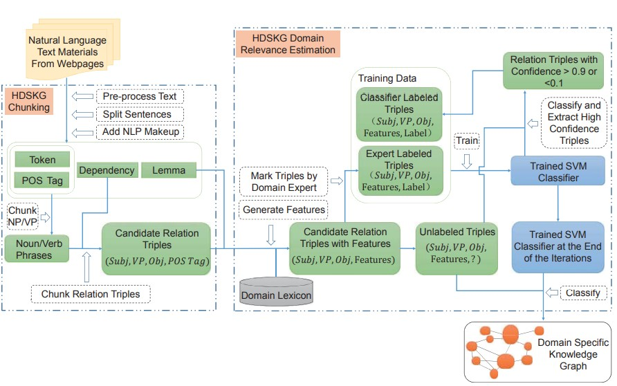

# The implementation of HDSKG using BERT model
[Paper link](https://ieeexplore.ieee.org/abstract/document/7884609)
## The architecture of HDSKG is as follows:
<!--  -->

      

## Installation
`pip install -r requirements.txt`

## Usage
__TODO__

## Test Bert Model
Compared with previous __0.76__, accuracy is improved to __0.82__. 
The checkpoint file will be uploaded soon.
__TODO__

## Knowledge Graph

